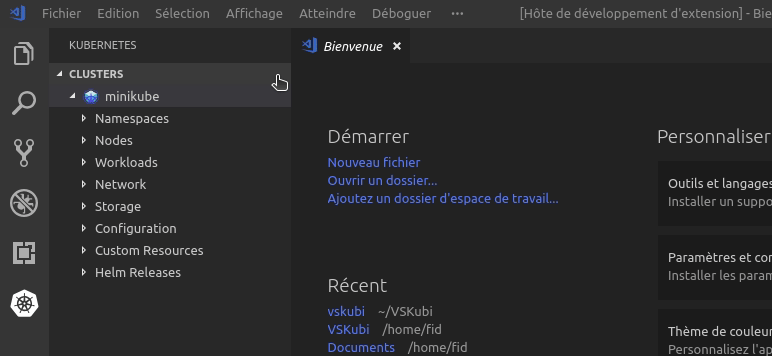

# VS Code Kubi extension

GUI integration in VSCode of Kubi CLI provided by CA-GIP at <https://github.com/ca-gip/kubi>
Thanks to the extension "Run Me" available at <https://github.com/tomzx/vscode-run-me/blob/master/README.md>

## Getting started

1. Download Kubi CLI an put it in your path, or set the path in the settings
2. Use `ctrl+k ctrl+i` to invoke the generation of the KubeConfig in your $home. Or use the palette command and type `ctrl+p` then `>kubi`
3. Answer the dialogs box and that's all

## Integration with Kubernetes extension

- <https://github.com/Azure/vscode-kubernetes-tools>
- The command is added on the contextuals menus hover the "clusters view"


## Configuration

```json
"vs-kubi": {
  "variables": {
    "$kubi-exe-path": "kubi"
  },
  "commands": [
    {
      "identifier": "generateKubeConfig",
      "description": "Generate kubernetes configuration",
      "command": "$kubi-exe-path --username $username --password $password --kubi-url $kubi-url --generate-config",
      "form": [
        {
          "variable": "$username",
          "question": "Kubi login (name@domain.com)"
        },
        {
          "variable": "$password",
          "password": true,
          "question": "Kubi password"
        },
        {
          "variable": "$kubi-url",
          "question": "Select Kubi endpoint",
          "options": [
            "https://kubi.cluster1.example.com",
            "https://kubi.cluster2.example.com"
          ]
        }
      ]
    }
  ]
}
```

## Advanced configuration tweak

- You can change the default key binding `ctrl+K ctrl+i` in the VSCode settings
- Tired of the input boxes ? You can remove any "input step" by deleting the section in the "form" configuration and fix your value in the "variables" section instead
- Need to use Kubi in various way ? Clone the default item in the `commands` array sections in settings, type you new identifier instead of `generateKubeConfig`, that's all ! If you need more help, read the great `Run me` documentation at <https://github.com/tomzx/vscode-run-me/blob/master/README.md>

## License

- The code is licensed under the [MIT license](http://choosealicense.com/licenses/mit/). See [LICENSE](LICENSE).
- Logo is CA-GIP/Kubi logo : <https://github.com/ca-gip/kubi>